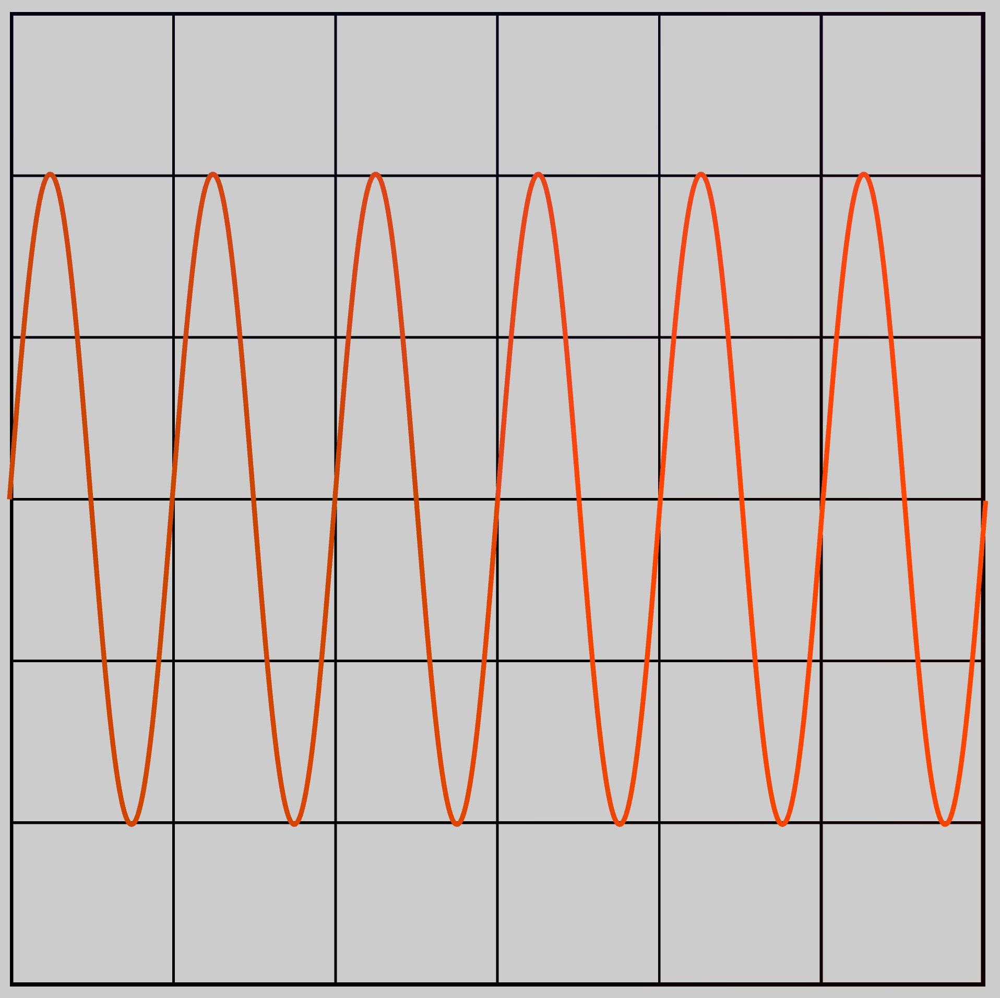

# Plot2D

## Описание

Класс для создания графика функции по заданным точкам. В результате будет создан PolygonsShape, который можно добавить в
сцену.

## Объявление

```C++
class Plot2D final : public detail::PolygonsShape
```

## Методы и конструкторы

<code class="language-C++">Plot2D(std::span<const float> x, std::span<const float> y, float thickness)</code> –
создает график функцию по заданным точкам.



