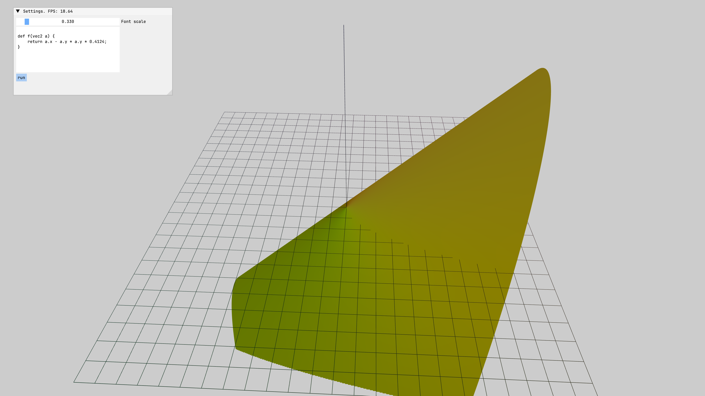

# Отрисовка пользовательской функции в 3D

## Описание

Создается приложение, в котором пользователь может вводить функцию на языке `ast-lang-2` и отрисовывать ее график в 3D.



## Код

```C++
#include <ast-lang-2/interpreter/interpreter.hpp>
#include <battery/embed.hpp>
#include <ccl/runtime.hpp>
#include <imgui.h>
#include <imgui_stdlib.h>
#include <mv/application_3d.hpp>
#include <mv/gl/axes_3d.hpp>
#include <mv/gl/instance_parameters.hpp>
#include <mv/gl/instances_holder.hpp>
#include <mv/gl/shape/function_3d.hpp>
#include <mv/gl/shape/sphere.hpp>
#include <mv/shader.hpp>
#include <mvl/mvl.hpp>

class FunctionGradientApplication final : public mv::Application3D
{
private:
    std::array<char, 128> imguiWindowBuffer{};

    mv::Shader colorShader = mv::Shader{
        {b::embed<"resources/shaders/colored_shader.vert">().str()},
        {b::embed<"resources/shaders/fragment.frag">().str()},
    };

    mv::gl::shape::Axes3D axes3D{12};
    mv::gl::InstancesHolder<mv::gl::InstanceParameters> instancing;
    mv::gl::shape::Function3D function;

    double pressTime = 0.0;
    float gradientA = 0.03F;
    float gradientK = 1.0F;
    float evaluationTimeNs = 0.0;
    float fontScale = 0.33F;
    ImFont *font = nullptr;

    std::string sourceCode = R"(
def f(vec2 a) {
    return a.x * a.x + a.y * a.y;
}
)";
    std::string programOutput = "";
    bool disableInput = false;

public:
    using Application3D::Application3D;

    auto init() -> void override
    {
        Application3D::init();

        setClearColor({0.8F, 0.8F, 0.8F, 1.0F});

        instancing.models = {mv::gl::InstanceParameters{
            .color = {1.0F, 0.0F, 0.0F, 1.0F},
            .transformation = glm::translate(glm::mat4{1.0F}, {2.5F, 2.0F, 8.0F}),
        }};

        glfwSetInputMode(window, GLFW_CURSOR, GLFW_CURSOR_DISABLED);

        function.loadData();
        axes3D.loadData();

        function.vbo.bind();
        function.vao.bind(0, 3, GL_FLOAT, sizeof(glm::vec3), 0);

        axes3D.vbo.bind();
        axes3D.vao.bind(0, 3, GL_FLOAT, sizeof(glm::vec3), 0);

        colorShader.use();
        colorShader.setMat4("model", glm::mat4(1.0f));
        colorShader.setVec4("elementColor", glm::vec4(0.5f, 0.5f, 0.0f, 1.0f));

        ImGui::StyleColorsLight();
        font = loadFont<"resources/fonts/JetBrainsMono-Medium.ttf">(45.0F);

        camera.setPosition(glm::vec3(0.0F, 12.0F, 10.0F));
    }

    auto update() -> void override
    {
        fmt::format_to_n(
            imguiWindowBuffer.data(), imguiWindowBuffer.size(),
            "Settings. FPS: {:#.4}###SettingWindowTitle", ImGui::GetIO().Framerate);

        ImGui::Begin(imguiWindowBuffer.data());
        ImGui::PushFont(font);
        ImGui::SetWindowFontScale(fontScale);

        ImGui::SliderFloat("Font scale", &fontScale, 0.1F, 3.0F, "%.3f");
        ImGui::InputTextMultiline("##Program input", &sourceCode);

        if (ImGui::Button("run")) {
            tryToDrawFunctionWithUserFunction();
        }

        disableInput = ImGui::IsWindowFocused();
        ImGui::TextUnformatted(programOutput.c_str(), programOutput.c_str() + programOutput.size());

        const glm::mat4 resulted_matrix = getResultedViewMatrix();

        colorShader.use();
        colorShader.setVec4("elementColor", glm::vec4(0.5f, 0.5f, 0.0f, 1.0f));
        colorShader.setMat4("projection", resulted_matrix);

        function.draw();

        colorShader.setVec4("elementColor", glm::vec4(0.1f, 0.1f, 0.1f, 1.0f));
        axes3D.draw();

        ImGui::PopFont();
        ImGui::End();
    }

    auto tryToDrawFunctionWithUserFunction() -> void
    {
        try {
            ccl::runtime::async(calculateFunctionPoints()).await();
        } catch (const std::exception &e) {
            programOutput = e.what();
        }
    }

    auto calculateFunctionPoints() -> isl::Task<>
    {
        auto node = ccl::runtime::async(mvl::parse(sourceCode, "stdin"));
        programOutput.clear();

        auto interpreter = mvl::newInterpreter(std::back_inserter(programOutput));
        (co_await node)->compute(interpreter);

        const auto *user_function = interpreter.getFunction(
            astlang2::function::FunctionIdentification{
                .name = "f",
                .arguments = isl::SmallVector<astlang2::ts::Type *, 4>{interpreter.getVec2()},
                .returnType = interpreter.getDouble()});

        const auto *vec2_constructor = interpreter.getFunction(
            astlang2::function::FunctionIdentification{
                .name = "vec2",
                .arguments =
                    isl::SmallVector<astlang2::ts::Type *, 4>{
                        interpreter.getDouble(), interpreter.getDouble()},
                .returnType = interpreter.getVec2()});

        const std::function function_invoker = [&user_function, &interpreter,
                                                vec2_constructor](glm::vec2 vec) {
            auto vec2 = vec2_constructor->call(
                interpreter, {astlang2::Value{
                                  .object = astlang2::AstlangObject<double>(vec.x),
                                  .type = interpreter.getDouble()},
                              astlang2::Value{
                                  .object = astlang2::AstlangObject<double>(vec.y),
                                  .type = interpreter.getDouble()}});

            const auto result = user_function->call(interpreter, {vec2});
            return static_cast<float>(*static_cast<double *>(result.object.get()));
        };

        const auto begin = std::chrono::high_resolution_clock::now();

        this->function.evaluatePoints(
            function_invoker, -10.0F, -10.0F, -15.0F, 10.0F, 10.0F, 15.0F);

        const auto end = std::chrono::high_resolution_clock::now();

        this->function.loadData();

        fmt::println("{}us", (end - begin) / std::chrono::microseconds(1));

        co_return;
    }

    auto processInput() -> void override
    {
        constexpr static auto key_press_delay = 0.2;

        if (!disableInput) {
            Application3D::processInput();
        }

        const auto left_alt_pressed = glfwGetKey(window, GLFW_KEY_LEFT_ALT) == GLFW_PRESS;
        const auto key_g_pressed = glfwGetKey(window, GLFW_KEY_G) == GLFW_PRESS;

        if (left_alt_pressed && key_g_pressed) {
            const auto mode = glfwGetInputMode(window, GLFW_CURSOR);
            const double new_press_time = glfwGetTime();

            if (new_press_time - pressTime < key_press_delay) {
                return;
            }

            pressTime = new_press_time;
            firstMouse = true;
            isMouseShowed = mode == GLFW_CURSOR_DISABLED;

            glfwSetInputMode(
                window, GLFW_CURSOR, isMouseShowed ? GLFW_CURSOR_NORMAL : GLFW_CURSOR_DISABLED);
        }
    }
};

auto main() -> int
{
    FunctionGradientApplication application{1000, 800, "Function Gradient", 16};
    application.run();
    return 0;
}
```